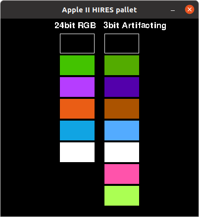
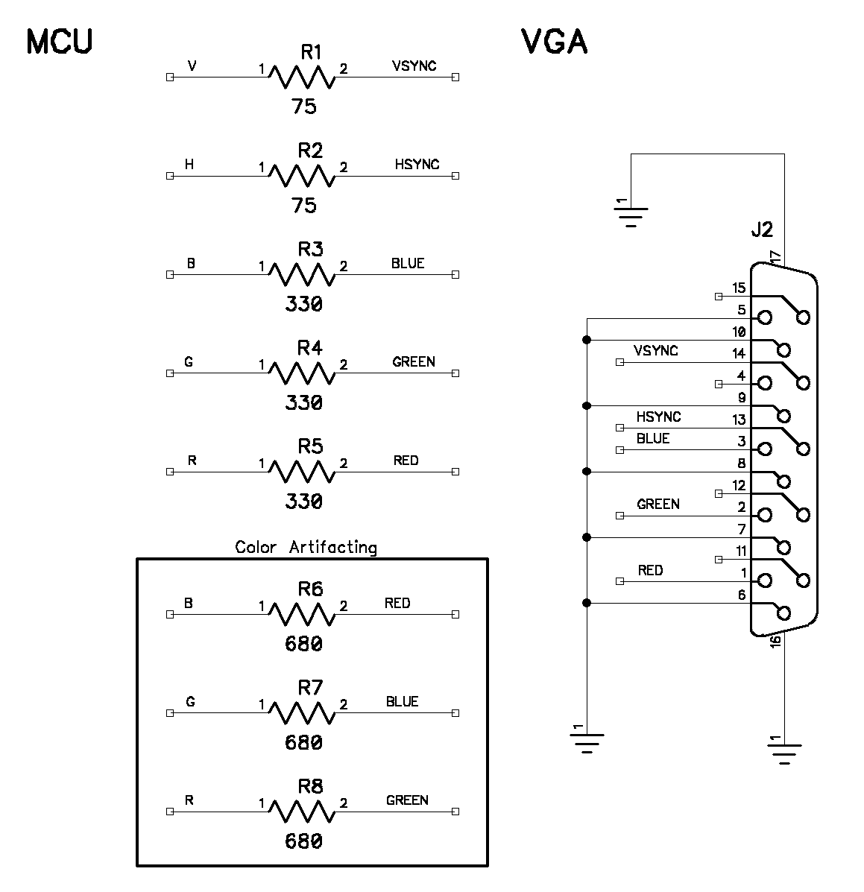

# Apple II 3 bit VGA Color Artifacting
How to get a similar affect to artifacting using 3 bit VGA color.


### Output from apple_ii_vga_artifacting.py

Run code in terminal:
```
python3 apple_ii_vga_artifacting.py
```

Modifying the value of R6 in the program will show the affect of adding the artifacting resistors. The last two colors are unused.

<p>
  
</p>

The amount of "artifacting" is from changing R6, R7, and R8 from the schematics below.

R3, R4, and R5 should be equal values resistors and R6, R7, and R8 should be equal values resistors.


### Schematics

<p>
  
</p>
